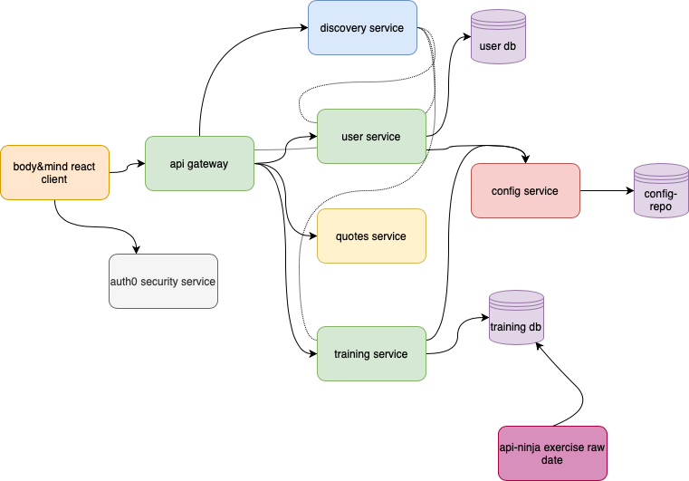

# Body & Mind App - Server

## Description

Bod&Mind is born from the phrase **Mens sana in corpore sano** in Latin, meaning *" a healthy mind in a healthy body "*. The phrase is used to explain that physical exercise plays or can play a big role in mental well-being.

Our app creates a space for users to follow programs with different workouts and exercises, as well as set and rep instructions, created by our official trainers. As well as being able to create and customize their own programs.

With a minimal and straightforward design, Body&Mind is the perfect place for you to ***take care of your mind by taking care of your body***.

## Set Up

1. Clone or Download the project from the repository.

2. Open the directory as a project on a IDE as IntelliJ.

3. Create the databases `user_service_db` and `training_service_db` in your SQL Workbench.

4. Run the *ConfigServiceApplication.java*, *DiscoveryServiceApplication.java*, *ApiGateway.java*,  *TrainingServiceApplication.java* and the *UserServiceApplication.java*

5. After running, check the tables are correctly created, and import the `api-ninja-data.csv` in the exercise_type table.

 

### Technologies Used

 Java    MySQL  SpringBoot  Microservices

 

## Application Structure

 

## Routes

| Route                               | Method | Access                                                                                                     |
|-------------------------------------|--------|------------------------------------------------------------------------------------------------------------|
| /api/exercises                      | GET    | Authenticated Users                                                                                        |
| /api/exercises/workout/{id}         | GET    | Authenticated Users Who Created that Workout, Or if its created by a Trainer then just Authenticated Users |
| /api/exercises/{id}                 | GET    | Authenticated Users Who Own that Exercise, Or if its created by a Trainer then just Authenticated Users    |
| /api/exercises/new                  | POST   | Authenticated Users Who Own the Workout the Exercise will be added to                                      |
| /api/exercises/edit/{id}            | PUT    | Authenticated Users Who Own that Exercise                                                                  |
| /api/exercises/delete/{id}          | DELETE | Authenticated Users Who Own that Exercise                                                                  |
| /api/exercise-types                 | GET    | Authenticated Users                                                                                        |
| /api/exercise-types/user/{id}       | GET    | Authenticated Users Who Created that ExerciseType                                                          |
| /api/exercise-types/creator/trainer | GET    | Authenticated Users                                                                                        |
| /api/exercise-types/{id}            | GET    | Authenticated Users Who Created that ExerciseType                                                          |
| /api/exercise-types/new             | POST   | Authenticated Users                                                                                        |
| /api/exercise-types/edit/{id}       | PUT    | Authenticated Users Who Own that ExerciseType                                                              |
| /api/exercise-types/delete/{id}     | DELETE | Authenticated Users Who Own that ExerciseType                                                              |
| /api/programs                       | GET    | Authenticated Users                                                                                        |
| /api/programs/user/{id}             | GET    | Authenticated Users Who Created that Program                                                               |
| /api/programs/creator/trainer       | GET    | Authenticated Users                                                                                        |
| /api/programs/{id}                  | GET    | Authenticated Users Who Created that Program                                                               |
| /api/programs/new                   | POST   | Authenticated Users                                                                                        |
| /api/programs/edit/{id}             | PUT    | Authenticated Users Who Own that Program                                                                   |
| /api/programs/delete/{id}           | DELETE | Authenticated Users Who Own that Program                                                                   |
| /api/repetitions                    | GET    | Authenticated Users                                                                                        |
| /api/repetitions/set/{id}           | GET    | Authenticated Users Who Created that Set                                                                   |
| /api/repetitions/{id}               | GET    | Authenticated Users Who Created that Repetition                                                            |
| /api/repetitions/new                | POST   | Authenticated Users Who Own the Set the Repetition will be added to                                        |
| /api/repetitions/edit/{id}          | PUT    | Authenticated Users Who Own that Repetition                                                                |
| /api/repetitions/delete/{id}        | DELETE | Authenticated Users Who Own that Repetition                                                                |
| /api/sets                           | GET    | Authenticated Users                                                                                        |
| /api/sets/exercise/{id}             | GET    | Authenticated Users Who Created that Exercise                                                              |
| /api/sets/{id}                      | GET    | Authenticated Users Who Created that Set                                                                   |
| /api/sets/new                       | POST   | Authenticated Users Who Own the Exercise the Set will be added to                                          |
| /api/sets/edit/{id}                 | PUT    | Authenticated Users Who Own that Set                                                                       |
| /api/sets/delete/{id}               | DELETE | Authenticated Users Who Own that Set                                                                       |
| /api/workouts                       | GET    | Authenticated Users                                                                                        |
| /api/workouts/program/{id}          | GET    | Authenticated Users Who Created that Program                                                               |
| /api/workouts/{id}                  | GET    | Authenticated Users Who Created that Set                                                                   |
| /api/workouts/new                   | POST   | Authenticated Users Who Own the Program the Workout will be added to                                       |
| /api/workouts/edit/{id}             | PUT    | Authenticated Users Who Own that Workout                                                                   |
| /api/workouts/delete/{id}           | DELETE | Authenticated Users Who Own that Workout                                                                   |
| /api/users                          | GET    | Admins                                                                                                     |
| /api/users/email/{email}            | GET    | Authenticated Users Who have that Email                                                                    |
| /api/users/{id}                     | GET    | Authenticated Users Who have that Id                                                                       |
| /api/users/new                      | POST   | Authenticated Users                                                                                        |
| /api/users/edit/{id}                | PUT    | Authenticated Users Who have that Id                                                                       |
| /api/users/delete/{id}              | DELETE | Authenticated Users Who have that Id                                                                       |

 

## Future Work

- Dividing the training service in 7 small services (program/workout/exercise/set/rep)

- Adding fitbit api to track user personal health stats to  further improve their wellbeing

 

## Resources

[Presentation slides](https://prezi.com/view/JRALWjNTbLOeUsSti07n/)

[Trello](https://trello.com/b/xrk45zcW/bodymind)

[Auth0 Api Authorization guide](https://auth0.com/docs/quickstart/backend/java-spring-security5/interactive)

[Auth0 Microservices ApiGateway Implementation eg](https://auth0.com/blog/apigateway-microservices-superglue/)
